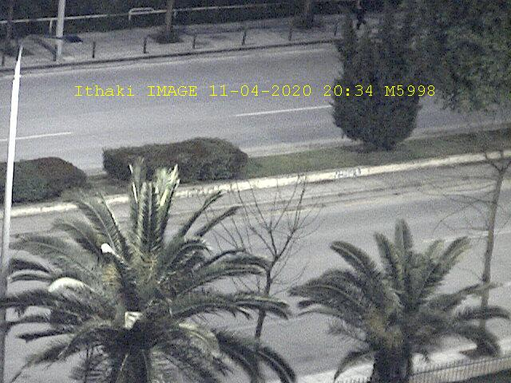
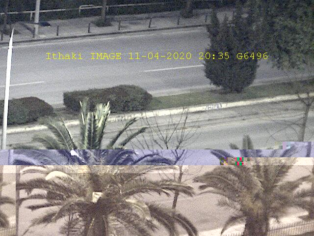

## Serial Communication

Running the project, a menu shows up, via with user can select an action. Each action requires a *keyword*, available only for 2 hours that is obtained through the input of University info:

1. Echo Request Code
2. Image without Noise Request Code
3. Image with Noise Request Code
4. GPS Request Code
5. ARQ Protocol, Ack/Nack Request Code


---

#### 1) Echo Request Code

The application sends to server *Ithaki* a message in the form **EXXXX\r** (where XXXX is the corresponding keyword described above) and receives packets in the form of:

```
PSTART DD-MM-YYYY HH-MM-SS PC PSTOP
```

DD-MM-YYYY is the date and HH-MM-SS is the time, while PC is a packet counter


---

#### 2) Image without Noise Request Code

The application sends to server *Ithaki* a message in the form **MXXXX\r** (where XXXX is the corresponding keyword). The server *Ithaki* responds with an image with **.jpeg** encoding of a Camera placed on the Faculty of Electrical Engineering at Aristotle University of Thessaloniki that does not include noise.


<p allign = "center">
    


---

#### 3) Image with Noise Request Code

Similarly as above, The application sends to server *Ithaki* a message in the form **GXXXX\r** (where XXXX is the corresponding keyword). The server *Ithaki* responds with an image with **.jpeg** encoding of a Camera placed on the Faculty of Electrical Engineering at Aristotle University of Thessaloniki that includes noise.


<p allign = "center">
    