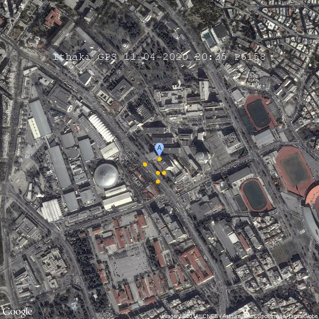
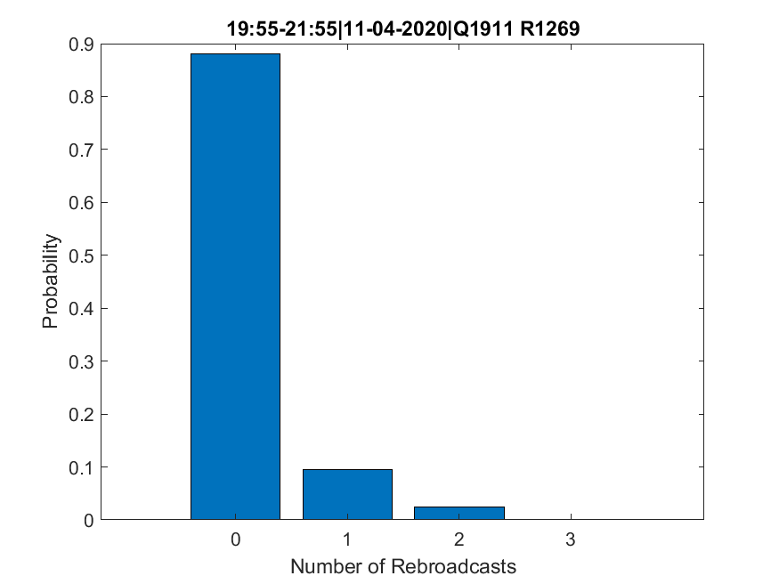

## Serial Communication

Running the project, a menu shows up, via with user can select an action. Each action requires a *keyword*, available only for 2 hours that is obtained through the input of University info:

1. Echo Request Code
2. Image without Noise Request Code
3. Image with Noise Request Code
4. GPS Request Code
5. ARQ Protocol, Ack/Nack Request Code


---

#### 1) Echo Request Code

The application sends to server *Ithaki* a message in the form of **EXXXX\r** (where XXXX is the corresponding keyword described above) and receives packets in the form of:

```
PSTART DD-MM-YYYY HH-MM-SS PC PSTOP
```

DD-MM-YYYY is the date and HH-MM-SS is the time, while PC is a packet counter


---

#### 2) Image without Noise Request Code

The application sends to server *Ithaki* a message in the form of **MXXXX\r** (where XXXX is the corresponding keyword). The server *Ithaki* responds with an image with **.jpeg** encoding of a Camera placed on the Faculty of Electrical Engineering at Aristotle University of Thessaloniki that does not include noise.


<p allign = "center">
    


---

#### 3) Image with Noise Request Code

Similarly as above, the application sends to server *Ithaki* a message in the form of **GXXXX\r** (where XXXX is the corresponding keyword). The server *Ithaki* responds with an image with **.jpeg** encoding of a Camera placed on the Faculty of Electrical Engineering at Aristotle University of Thessaloniki that includes noise.


<p allign = "center">
    


---

#### 4) GPS Request Code

The application sends to server *Ithaki* a message in the form of **PXXXXR=ΧPPPPLL\r**, where XXXX is the corresponding keyword, X (1 to 9) is the number of predefined routes saved in the server, PPPP is the starting point of the route and LL is the number of the points in route X. 

The data received from the server stand for GPS positioning information coded with respect to **NMEA protocol**. A typical message received is in the form of:

```
$GPGGA,045208.000,4037.6331,N,02257.5633,E,1,07,1.5,57.8,M,36.1,M,,0000*6D
```

where **GPGGA** is the header, 04:52:08 is the time of the transmission, 40<sup>o</sup> 37.6331΄ is the **latitude north**, 22<sup>o</sup> 57.5633΄ is the **longitude east**, 07 the number of **active satellites** and 57.8 m the **height** of the position from the surface of the sea. To find a route we have to choose 9 of **GPGGA** messages with timestamps that abstain at least 4 seconds. To indicate the start of the transmission the server sends a message **START ITHAKI GPS TRACKING\r\n**, while to indicate the end of the transmission sends **STOP ITHAKI GPS TRACKING\r\n**. Finally, there is a parameter **Τ=ΑΑΒΒΓΓΔΔΕΕΖΖ**, that can be repeated 9 times after the keyword, which represents a trace with latitude AA<sup>o</sup>BB'ΓΓ'' and longitude ΔΔ<sup>o</sup>ΕΕ'ΖΖ'', depicted on image obtained by **Google Maps**.


<p allign = "center">
    


---

#### 5) Ack/Nack Request Code

The application sends to server *Ithaki* messages in the form of **QXXXX\r** and **RXXXX\r** for a Ack and Nack process. The purpose of this part is the testing of an **ARQ (automatic repeat request)** mechanism that detects and retransmits the errored packets. The sever responds with a message:

```
PSTART DD-MM-YYYY HH-MM-SS <XXXXXXXXXXXXXXXX> FCS PSTOP
```

where *XXXXXXXXXXXXXXXX* stands for an encrypted message. In order to detect potential wrong bits a *FCS* field exist that is the result of the logical **XOR operator** applied to the encrypted message for each character sequentially. In case of matching we have a correct transmission and the message *QXXXX\r* is written to the server. Otherwise we have a wrong transmission and the application asks the server for a retransmission via the message *RXXXX\r*. The number of Rebroadcasts is shown in the next graph:


<p allign = "center">
    
</p>


Finally, a **BER (bit error rate)** metric is calculated:  **BER = 1 - P<sup>1/L</sup>**, where P is the probability of error per bit and L the length of the packet.


